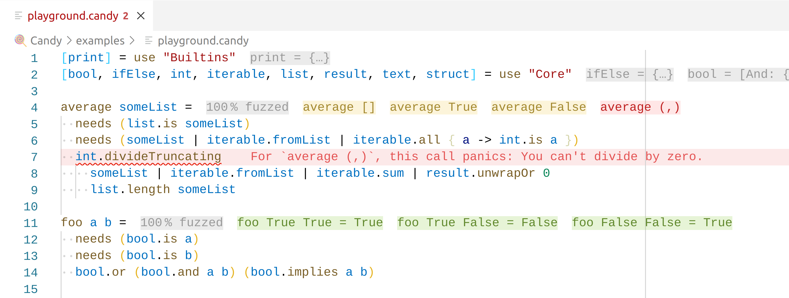

# 🍭 Candy

> **🚧 Work in Progress!**
>
> Candy is still in its early stages.
> We are actively working on it, but it's not ready for production use yet.
> If you want to help, please join our [Discord server].
> See also: [The current state](#the-current-state).

A sweet, functional programming language that is robust, minimalistic, and expressive.

Many programming languages have a strict separation between compile-time and runtime errors.
Sometimes, this border can seem arbitrary:
Dividing by a string fails during compilation with a type error, while dividing by zero only fails during runtime.
In the mathematical sense, there's no fundamental difference between these cases – division is only defined for divisors that are non-zero numbers.
That's why we eliminate the border between compile-time and runtime errors – all errors are runtime errors.
By crafting high-quality tooling with dynamic analyses such as fuzzing, we try to still be able to show most errors while you're editing the code.
In fact, we try to show more errors than typical statically typed languages.



## Quick introduction

- **Values are at the center of your computations.**
  Only a handful of predefined types of values exist:

  ```candy
  3                   # int
  "Candy"             # text
  Green               # tag (uppercase)
  Error ListIsEmpty   # tag with a value
  (Foo, Bar)          # list
  [Name: "Candy"]     # struct
  { it -> add it 2 }  # function
  ```

- **Minimalistic syntax.**
  Defining variables and functions works without braces or keywords cluttering up your code.
  The syntax is indentation-aware.

  ```candy
  # I'm a comment
  foo = 42                # variable (lowercase)
  println message =       # function
    print message         # function call
    print "\n"
  println "Hello, world!"
  ```

- **Extensive compile-time evaluation.**
  Many values can already be computed at compile-time.
  In your editor, you'll see the results on the right side:

  ```candy
  foo = double 2  # foo = 4
  ```

- **Fuzzing instead of traditional types.**
  In Candy, functions have to specify their needs _exactly._
  As you type, the tooling automatically tests your code with many inputs to see if one breaks the code:

  ```candy
  foo a =             # If you pass a = 0,
    needs (isInt a)
    math.logarithm a  # then this panics: The `input` must be a positive number.

  efficientTextReverse text =
    needs (isText text)
    needs (isPalindrome text) "Only palindromes can be efficiently reversed."
    text

  greetBackwards name =                   # If you pass name = "Test",
    "Hello, {efficientTextReverse name}"  # then this panics: Only palindromes can be efficiently reversed.
  ```

For more info, read:

- Marcel's blog post about Candy: https://marcelgarus.dev/candy
- the [language documentation](language.md)
- Marcel's blog post about Candy's compiler pipeline: https://marcelgarus.dev/candy-compiler-pipeline

## The current state

We are currently implementing a first version of Candy in Rust.
We already have a CLI, language server, and Visual Studio Code extension that provide some tooling.

The language is still in its early stages, and we are actively working on it.
There are still compiler bugs and performance improvements that need work before this language is ready for production use.

## Discussion

[Join our  Discord server.][Discord server]

## How to use Candy

1. Install [ Rust](https://rust-lang.org): [rust-lang.org/tools/install](https://rust-lang.org/tools/install) (use Rustup since we use nightly features).
   - Alternatively, use the provided [ Nix](https://nixos.org/) flake to install all required dependencies.
2. Clone this repo.

Then, you can use Candy in two ways:

### Use the VS Code Extension

1. Install [ Visual Studio Code (VS Code)](https://code.visualstudio.com): [code.visualstudio.com/download](https://code.visualstudio.com/download).
2. Open the workspace (`compiler.code-workspace`) in VS Code.
3. Install the recommended VS Code extensions.
4. Run `npm install` inside `vscode_extension/`.
5. Run the launch config “Run Extension (VS Code Extension)”.
6. In the new VS Code window that opens, you can enjoy 🍭 Candy :)

If you are working on the Rust code itself, you might want to disable release mode for quicker compilation:
In `packages/candy.code-workspace`, in the `candy.languageServerCommand` setting, remove `--release`.
(But don't commit that change.)

### Use the CLI

From the root of this repository, you can run the Candy CLI by starting the Candy commands with `cargo run --release --`:

```sh
# Run a Candy file:
cargo run --release -- run ./packages/Examples/helloWorld.candy

# View all available commands:
cargo run --release -- help
```

(Everything after `--` is passed to Candy, everything before it to Cargo.)

## Environment Variables for Debugging the Compiler

```sh
# Don't normalize IDs (number them sequentially) after optimizing the MIR.
CANDY_MIR_NORMALIZE_IDS=false

# Generate a _large_ Markdown file that lists every single optimization step
# performed on the MIR.
CANDY_MIR_OPTIMIZATION_LOG=target/optimization-log.md
```

[Discord server]: https://discord.gg/5Vr4eAJ7gU
